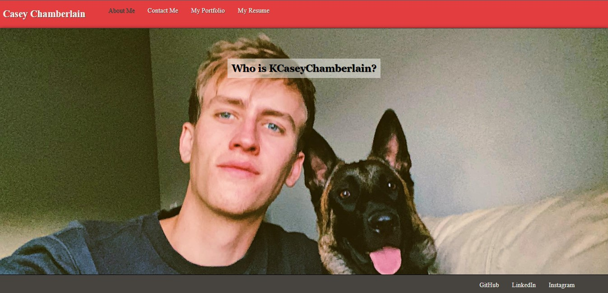

# KCaseyChamberalain React Portfolio
### Description
This web application is a single-page React Portfolio web application. Here you will be able to view who I am, provided a way to contact me, view my previous work, and view my resume.
### License

This application is licensed under MIT

### Application Demo

### Table of Contents
- [Description](#description)
- [Contributing](#contributing)
- [Tests](#tests)
- [Questions?](#questions)

### Contributing
No contributions at this time.

### Tests
N/A

### Questions
GitHub Username: (kcaseychamberlain) 

View the project in GitHub at: https://github.com/KCaseyChamberlain/kcaseychamberlain-react-portfolio

View the application live hosted at: https://kcaseychamberlain.github.io/kcaseychamberlain-react-portfolio/

If you have any questions, contact Casey at: caseygchamberlain@gmail.com